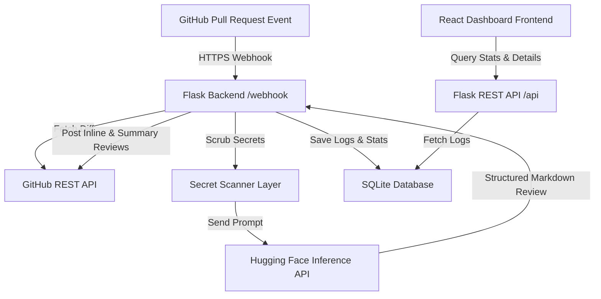

# PR-Shield AI: Powered Code Review Assistant

PR-Shield AI is an intelligent, developer-friendly automation pipeline that performs strict, automated code reviews on GitHub Pull Requests. It analyzes PR diffs using the state-of-the-art `Qwen/Qwen2.5-Coder-32B-Instruct` model on the Hugging Face Inference API, posts overall code reviews and inline code suggestions back to GitHub, and renders review logs, performance stats, and code differentials on a premium glassmorphic dark-mode dashboard.

---

## System Architecture



---

## Folder Structure

- `/backend`: Flask REST API, SQLite models, secret scanner, background worker thread queue, and mock database seeds.
- `/frontend`: Vite-based React application utilizing a unified styling system, charts, and inline code diff highlighter.

---

## Prerequisites
Ensure you have the following installed on your machine:
- **Python 3.8+**
- **Node.js 16+ & npm**
- **ngrok** (or alternative webhook proxy to expose local ports)

---

## Setup & Local Execution

### 1. Configure the Environment
1. Copy the template environment file in the `backend/` directory:
   ```bash
   cp backend/.env.example backend/.env
   ```
2. Configure the following keys inside `backend/.env`:
   - `GITHUB_APP_ID`: The numeric App ID from your GitHub App configuration.
   - `GITHUB_WEBHOOK_SECRET`: The webhook HMAC signature secret key.
   - `GITHUB_PRIVATE_KEY_PATH`: Path to your downloaded private key `.pem` certificate.
   - `HF_API_TOKEN`: Your Hugging Face user access token.

### 2. Install & Run (Root Scripts)
Initialize a Python virtual environment and run the simplified project-wide commands from the root directory:

```bash
# 1. Create python virtual environment
python -m venv venv

# 2. Activate virtual environment
# Windows (PowerShell):
venv\Scripts\activate
# macOS/Linux:
source venv/bin/activate

# 3. Install all dependencies (Frontend and Backend)
npm run install:all

# 4. Seed the database (optional, for immediate dashboard metrics)
npm run seed:db

# 5. Run both Frontend and Backend concurrently
npm run dev
```

- React Frontend runs on: **`http://localhost:5173`**
- Flask API runs on: **`http://localhost:5000`**

---

## Exposing the GitHub Webhook Proxy

GitHub needs to deliver events to your local Flask app. Expose your server using `ngrok`:

1. Expose Flask port `5000`:
   ```bash
   ngrok http 5000
   ```
2. Copy the resulting forwarding URL (e.g., `https://a1b2-34-56-78.ngrok-free.app`).
3. Go to your **GitHub App Settings**:
   - Set the **Webhook URL** to: `https://<your-ngrok-subdomain>.ngrok-free.app/webhook`
   - Set the **Webhook Secret** to match your configured `GITHUB_WEBHOOK_SECRET` in `.env`.
   - Under **Permissions & Events**, enable **Read & Write** access to **Pull Requests**.
   - Check the box to subscribe to **Pull Request** events (`opened`, `reopened`, `synchronize`).
4. Trigger the pipeline by opening a Pull Request in any repository where the GitHub App is installed!

---

## Security Layer: Secret Scanning
To protect your repositories, the backend features a **Secret Scanner Layer** in `backend/app/services/ai_service.py` that intercepts the PR description and git diff code. It scrubs the following credentials before sending payloads to Hugging Face:
- GitHub PATs (`ghp_*`) and Patches.
- Hugging Face API tokens (`hf_*`).
- Hardcoded password strings, generic API keys, and auth hashes inside double or single quotes (replacing them with `[REDACTED_SECRET]` tags while keeping code syntax compiling).
